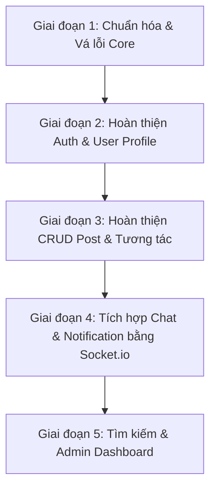

# Phân Tích Hiện Trạng & Lộ Trình Phát Triển Dự Án Instagram Clone

Báo cáo phân tích hiện trạng mã nguồn của dự án (FE & BE) và đề xuất các bước triển khai tiếp theo nhằm hoàn thiện đầy đủ các tính năng được yêu cầu.

---

## 1. Trạng Thái Hiện Tại Của Dự Án

### Công Nghệ Đã Sử Dụng (Tech Stack)
*   **Backend**: NodeJS/Express, MongoDB/Mongoose, JWT (`jsonwebtoken`), Multer, AWS SDK (đang dùng Cloudflare R2 lưu trữ).
*   **Frontend**: React (v19), React Router (v7), Axios, TailwindCSS (v4), Lucide React.
*   **Chưa cài đặt/cấu hình**: Redux Toolkit/Context nâng cao, React Query/TanStack Query, Socket.io (BE & FE), Redis, Cloudinary.

---

## 2. Đối Chiếu Tính Năng (Yêu Cầu vs Thực Tế)

| Danh mục | Tính năng yêu cầu | Trạng thái thực tế | Đánh giá & Chi tiết |
| :--- | :--- | :--- | :--- |
| **Authentication** | Đăng nhập (Login) | ⚠️ Tạm xong | BE kiểm tra mật khẩu thô (chưa hash). FE có UI cơ bản, lưu token ở LocalStorage. |
| | Đăng ký (Register) | ❌ Chưa xong | BE có API nhưng lỗi mongoose validation do thiếu trường `email` bắt buộc và password chưa hash. FE: Trang `Register.jsx` trống rỗng. |
| | Refresh Token | ❌ Chưa có | Chỉ sử dụng 1 Access Token có hạn 1 ngày. |
| | Đăng xuất (Logout) | ⚠️ Tạm xong | Chỉ xoá token ở Client. Chưa có API thu hồi token ở Backend. |
| | Quên mật khẩu / Xác thực Email | ❌ Chưa có | Chưa có API gửi email, OTP hay UI tương ứng. |
| **User** | Cập nhật hồ sơ (Profile) | ❌ Chưa có | Chưa có API update. FE: UI trang Profile đang hardcode toàn bộ thông tin. |
| | Avatar / Cover / Bio | ❌ Chưa có | Chưa có upload ảnh đại diện/ảnh bìa. Bio đang hardcode. |
| | Follow / Unfollow | ❌ Chưa có | Thiếu schema `followers`/`following` ở User Model và API xử lý follow. |
| **Post** | CRUD Bài viết | ⚠️ Lỗi nặng | BE: Chỉ có `createPost` và `getAllPosts` hoạt động với DB. Các API `getPostById`, `updatePost`, `deletePost` đang sử dụng một mảng tĩnh lưu trong RAM và tìm kiếm theo ID kiểu Integer (`parseInt`) khiến API bị lỗi/không hoạt động với MongoDB ObjectID. |
| | Upload nhiều ảnh | ❌ Chưa xong | BE hỗ trợ qua `upload.array`, nhưng FE (`ModalUpload.jsx`) mới chỉ cho phép chọn duy nhất 1 ảnh (`files?.[0]`). |
| | Video | ⚠️ Tạm xong | Cho phép chọn file video và render thẻ `<video>`, lưu trữ tạm qua R2. |
| | Like | ❌ Chưa xong | Chỉ có trường `likeCount` kiểu số trên schema, chưa có danh sách user đã like để toggle và kiểm tra trạng thái đã like. |
| | Save / Share | ❌ Chưa có | Chưa thiết lập Schema và API. |
| | Comment | ⚠️ Lỗi nặng | Model Comment chưa được tạo. `commentController.js` hiện tại lưu dữ liệu tạm bằng mảng tĩnh trong RAM, tìm kiếm theo integer ID nên không lưu vào DB. |
| **Chat** | Chat Socket.io | ❌ Chưa có | Chưa tích hợp Socket.io ở cả hai phía. Trang `Message.jsx` ở FE mới chỉ là component tĩnh chứa placeholder text. |
| | Online/Offline/Seen/Typing... | ❌ Chưa có | Chưa triển khai logic Socket.io tương ứng. |
| | Gửi ảnh / Emoji | ❌ Chưa có | Chưa phát triển. |
| **Notification** | Sockets (Like/Comment/Follow)| ❌ Chưa có | Chưa có hệ thống thông báo thời gian thực. Trang `Notify.jsx` là placeholder. |
| **Search** | Tìm kiếm User & Hashtag | ❌ Chưa xong | FE (`SearchPage.jsx`) đang tự filter danh sách bài viết offline bằng Javascript theo caption bài viết. Chưa có API tìm kiếm từ Backend. |
| **Admin** | Dashboard (Thống kê) | ❌ Chưa có | Chưa có User Role, API thống kê bài viết/người dùng. |
| | Report / Khóa User | ❌ Chưa có | Chưa có Schema Report hay thuộc tính `isLocked`/`status` trên User. |

---

## 3. Các Vấn Đề Nghiêm Trọng Cần Sửa Ngay (Critical Bugs)

> [!WARNING]
> Cần ưu tiên khắc phục các lỗi thiết kế hệ thống sau đây trước khi phát triển tính năng mới:
> 1. **Mật khẩu lưu dạng Text thô (Plain Text)**: Cần tích hợp `bcryptjs` để hash mật khẩu trước khi lưu vào MongoDB.
> 2. **Lỗi Đăng ký (Register Validation)**: Schema `User.js` yêu cầu trường `email` bắt buộc (`required: true`) và duy nhất, nhưng API Register chỉ nhận `username` và `password`, dẫn đến việc không thể tạo tài khoản mới.
> 3. **API Post & Comment sử dụng mảng tĩnh trong RAM**: Các API chi tiết của Post (`getPostById`, `updatePost`, `deletePost`) và toàn bộ API Comment đang thao tác trên mảng Javascript tạm thời (`let posts = []`, `let comments = []`) và sử dụng ID dạng số (`parseInt`). Cần chuyển đổi toàn bộ sang truy vấn MongoDB qua Mongoose.
> 4. **Lưu trữ Cloudinary vs Cloudflare R2**: Hiện tại dự án đang dùng Cloudflare R2 (cấu hình S3 SDK), nhưng danh sách yêu cầu của bạn ghi là dùng **Cloudinary**. Cần xác định rõ sẽ tiếp tục dùng R2 hay chuyển hẳn sang Cloudinary.

---

## 4. Hướng Làm Tiếp Theo (Lộ Trình Từng Bước)

Tôi đề xuất chia quá trình hoàn thiện dự án thành 5 giai đoạn chính như sau:

### Giai đoạn 1: Chuẩn hóa DB & Vá lỗi cốt lõi (Core Fixing)
1. **Bảo mật mật khẩu**: Cài đặt `bcryptjs` ở Backend. Chỉnh sửa controller register để hash mật khẩu và controller login để so sánh mật khẩu mã hóa.
2. **Sửa API Đăng ký**: Cập nhật form đăng ký ở frontend và API đăng ký ở backend để lấy thêm trường `email`.
3. **MongoDB Hóa Post & Comment**: 
   * Viết Model `Comment.js` trong Mongoose (gồm: `postId`, `author` (User ref), `content`, `createdAt`).
   * Sửa các hàm `getPostById`, `updatePost`, `deletePost` trong `postController.js` và toàn bộ `commentController.js` để truy vấn từ MongoDB.
4. **Quyết định Cloudinary hay R2**: Nếu chọn Cloudinary, cài đặt thư viện `cloudinary` ở BE và cấu hình lại file middleware `upload.js` để đẩy ảnh trực tiếp lên Cloudinary.

### Giai đoạn 2: Hoàn thiện Authentication & Quản lý User
1. **Refresh Token**:
   * Tạo Access Token (hạn ngắn, ví dụ 15 phút) và Refresh Token (hạn dài, ví dụ 7 ngày).
   * Lưu Refresh Token vào Cookie (HttpOnly) hoặc lưu trữ trong Database/Redis.
   * Viết interceptor phía Frontend (`apiClient.js`) tự động gọi API `/auth/refresh` khi Access Token hết hạn (lỗi 401).
2. **Verify Email & Forgot Password**:
   * Cài đặt `nodemailer`. Tạo trường `isVerified` và token xác thực trong `User.js`.
   * Viết API gửi link xác thực khi đăng ký và API gửi link reset mật khẩu khi quên mật khẩu.
3. **Trang đăng ký (Register UI)**: Viết giao diện đầy đủ cho `Register.jsx` kết nối với API đăng ký mới.
4. **Cập nhật Profile & Follow**:
   * Cập nhật `User.js` schema thêm: `cover`, `followers` (mảng User IDs), `following` (mảng User IDs).
   * Viết API cập nhật Profile (Avatar, Cover, Bio) và API `/users/:id/follow` (thêm ID chéo giữa hai user).
   * Cập nhật UI trang Profile ở Frontend để lấy dữ liệu động và có nút bấm chỉnh sửa/follow.

### Giai đoạn 3: Hoàn thiện Bài viết & Tương tác (Post, Likes, Comments, Saves)
1. **Upload nhiều ảnh**:
   * Cập nhật `ModalUpload.jsx` ở FE để cho phép chọn nhiều ảnh và hiển thị preview (carousel) trước khi nhấn đăng bài.
   * Đảm bảo backend nhận mảng ảnh và upload toàn bộ lên Cloud (R2/Cloudinary).
2. **Hệ thống Likes**:
   * Thêm trường `likes` (mảng User IDs) vào `Post.js` schema.
   * Viết API `/posts/:id/like` để toggle like. Trả về trạng thái đã like cho client để hiển thị màu đỏ của biểu tượng trái tim.
3. **Hệ thống Saves**:
   * Thêm trường `savedPosts` (mảng Post IDs) vào `User.js` schema hoặc tạo Model `Save.js`.
   * Viết API toggle lưu bài viết và hiển thị tab "Đã lưu" trên trang Profile.
4. **Infinite Scroll & Lazy Loading & Skeletons**:
   * Thay đổi API lấy danh sách bài viết hỗ trợ phân trang (Pagination với `limit` và `skip` hoặc cursor-based).
   * Cài đặt thư viện hoặc viết hook Infinite Scroll ở Frontend để tải thêm bài viết khi cuộn trang.
   * Tạo các component Skeleton loading thay thế cho loading spinner khi dữ liệu đang tải.

### Giai đoạn 4: Xây dựng Chat & Thông báo Thời gian thực (Socket.io)
1. **Cấu hình Socket.io Server**:
   * Tích hợp socket.io vào `BE/src/index.js`.
   * Quản lý trạng thái Online/Offline bằng cách ánh xạ `socket.id` với `userId` (có thể kết hợp sử dụng **Redis** để lưu session/cache trạng thái đăng nhập như yêu cầu).
2. **Tính năng Chat**:
   * Viết Model `Message.jsx` (người gửi, người nhận, nội dung, loại tin nhắn: text/image, seen, thời gian).
   * Xử lý các sự kiện socket: `send_message`, `receive_message`, `typing`, `stop_typing`, `mark_seen`.
   * Xây dựng giao diện Chat hoàn chỉnh ở `Message.jsx` (danh sách hội thoại, khung chat, tải tin nhắn cũ, gửi ảnh, chọn emoji).
3. **Hệ thống Thông báo**:
   * Tạo Model `Notification.js` (gửi từ ai, nhận bởi ai, loại thông báo: like/comment/follow, liên kết post).
   * Gửi thông báo real-time qua Socket khi có hành động tương tác và lưu vào DB để xem lại ở trang `Notify.jsx`.

### Giai đoạn 5: Tìm kiếm & Admin Dashboard
1. **Tìm kiếm (Search)**:
   * Viết API tìm kiếm người dùng theo username/fullname và bài viết theo hashtag.
   * Tích hợp API vào trang `SearchPage.jsx` ở Frontend.
2. **Admin Dashboard**:
   * Thêm trường `role` (`user` hoặc `admin`) và `isLocked` (boolean) vào User model.
   * Viết middleware phân quyền admin (`isAdmin`).
   * Viết các API thống kê tổng số user, số bài viết và danh sách báo cáo (Reports).
   * Xây dựng trang Dashboard quản trị cho admin để thống kê và thực hiện khóa/mở khóa tài khoản người dùng.

---

## 5. Kế Hoạch Xác Minh (Verification Plan)

### Kiểm thử tự động (Automated Tests)
*   Sử dụng công cụ kiểm thử API (như Postman hoặc REST Client trong VSCode) để test các endpoint cốt lõi sau khi sửa lỗi.
*   Viết test script cơ bản cho phần xác thực người dùng và đăng bài.

### Kiểm thử thủ công (Manual Verification)
*   Chạy đồng thời BE (`npm run dev`) và FE (`npm run dev`) để kiểm tra toàn bộ luồng đăng ký -> đăng nhập -> xem bài viết -> đăng bài viết mới với ảnh thực tế.
*   Kiểm tra tính phản hồi (responsive) của giao diện web trên nhiều kích thước màn hình khác nhau.
